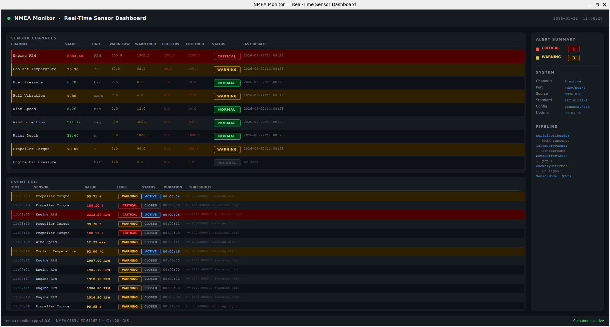

# nmea-monitor-cpp

> Real-time sensor monitoring system for naval embedded platforms, built with **C++20** and **Qt6/QML**.



---

## What this project is

Modern vessels carry dozens of onboard sensors — engine RPM, coolant temperature, fuel pressure, hull vibration, water depth — all emitting data continuously over a shared serial bus following the NMEA-0183 protocol. Someone has to read that bus, separate each instrument's data, detect when something goes out of range, and show it to the operator in real time.

**nmea-monitor-cpp** does exactly that. It implements a complete pipeline from raw serial data to a live operator dashboard, with session logging and alert tracking.

The system is built around one core principle: **the monitor is generic infrastructure**. The systems engineer configures which instruments to monitor, on which port, with which thresholds — all in a JSON file, without touching the code. Adding a new instrument to the dashboard requires zero code changes.

This project demonstrates the direct transferability of aerospace software architecture (real-time telemetry pipelines, DO-178B safety levels, hardware abstraction through simulation) to the naval domain under the NMEA-0183 / IEC 61162-1 maritime standard.

---

## Technology stack

| Layer | Technology | Purpose |
|-------|-----------|---------|
| Language | C++20 | Core pipeline, threading, templates |
| UI framework | Qt 6 / QML | Operator dashboard |
| Build system | CMake 3.21+ / Ninja | Multi-target build |
| Testing | Google Test | Unit tests, concurrent stress tests |
| Serial I/O | POSIX termios | Raw serial port access |
| Simulation transport | POSIX pty (`posix_openpt`) | Virtual serial pair — no external dependencies |
| Configuration | JSON | Instrument and threshold definition |
| Platform | Linux / WSL | Primary target |

---

## NMEA-0183 and IEC 61162-1

**NMEA-0183** is the serial communication standard published by the National Marine Electronics Association. It defines how marine instruments communicate over a shared RS-422 bus: sentence format, XOR checksum, talker identifiers, and a default baud rate of 4800 bps. Virtually all marine navigation equipment — GPS receivers, depth sounders, anemometers, engine monitors — speaks NMEA-0183.

A typical sentence looks like this:
```
$IIRPM,E,1,1450.0,45.0,A*3F
 ││││└── checksum (XOR of all bytes between $ and *)
 │││└─── fields: engine instance, RPM, pitch, status
 ││└──── sentence type: RPM
 │└───── talker: Integrated Instrumentation
 └────── sentence start
```

**IEC 61162-1** is the adoption of NMEA-0183 by the International Electrotechnical Commission. Technically identical, it is the reference used in formal naval certification (SOLAS, IMO). Implementing both means the software is aligned with both the practical industry standard and the regulatory framework.

---

## Architecture

The system is two completely independent executables. They share no code at runtime — they communicate exclusively through a serial port, exactly as a physical instrument and a monitor would on a real vessel.

```
┌──────────────────────────────────────────────────┐
│  nmea_simulator           (development only)     │
│                                                  │
│  Opens a POSIX pty pair (posix_openpt)           │
│  Prints slave path: "pty:/dev/pts/4"             │
│  SensorSimulator writes NMEA to master fd        │
│                                                  │
│  Physical models per channel:                    │
│    Engine RPM   → first-order lag, regime shifts │
│    Coolant Temp → thermal inertia, tracks RPM    │
│    Wind Speed   → Gaussian noise + gust events   │
│    Water Depth  → slow sinusoidal variation      │
│    ...                                           │
└───────────────────┬──────────────────────────────┘
                    │
                    │  /dev/pts/4  (or /dev/ttyUSB0 in production)
                    │  NMEA-0183 sentences at 4800 baud
                    │
┌───────────────────▼──────────────────────────────┐
│  nmea_monitor                (the product)       │
│                                                  │
│  SerialPortReader  (I/O thread)                  │
│    └─► SensorHub::ingest()                       │
│          └─► TelemetryParser::parse()            │
│                └─► DataBuffer<SensorFrame, 256>  │
│                      └─► AnomalyDetector         │
│                            └─► AlertTracker      │
│                                  └─► SessionLogger│
│                                  └─► SensorModel  │
│                                        └─► QML   │
└──────────────────────────────────────────────────┘
```

**The monitor does not know the simulator exists.** It opens whatever port is defined in `sensors.json` and reads NMEA sentences from it. The source of those sentences — a simulator, a physical instrument, or a recorded replay — is entirely transparent to the monitor code.

### Directory structure

```
nmea-monitor-cpp/
├── core/                       # Pure C++20 — no Qt dependency
│   ├── include/nmea/
│   │   ├── DataBuffer.hpp      # Thread-safe ring buffer (fixed capacity)
│   │   ├── SensorFrame.hpp     # Core data type: id, value, unit, alertLevel
│   │   ├── SensorConfig.hpp    # JSON loader → LoadedConfig struct
│   │   ├── TelemetryParser.hpp # Generic NMEA parser, config-driven
│   │   ├── AnomalyDetector.hpp # Strategy pattern threshold evaluator
│   │   ├── SensorHub.hpp       # Pipeline orchestrator, worker thread
│   │   ├── AlertTracker.hpp    # Alert open/close state machine
│   │   └── SessionLogger.hpp   # Per-session log file with salvaguarda
│   └── src/
├── serial/                     # Serial port I/O
│   ├── include/nmea/
│   │   └── SerialPortReader.hpp  # POSIX termios, non-blocking, line dispatch
│   └── src/
├── simulator/                  # Independent executable — not linked to monitor
│   ├── include/nmea/
│   │   └── SensorSimulator.hpp   # Physical models + NMEA sentence builders
│   └── src/
│       ├── SensorSimulator.cpp
│       └── main.cpp              # posix_openpt() pty management
├── monitor/                    # Qt6/QML application
│   ├── src/
│   │   ├── main.cpp              # Pipeline wiring, Qt setup
│   │   ├── SensorModel.hpp       # QAbstractListModel, Q_PROPERTY counters
│   │   └── SensorModel.cpp       # Thread-safe model + EventLogModel
│   └── qml/
│       └── Main.qml              # Dashboard: channel table, event log, system info
├── tests/                      # Google Test — 32 unit tests
├── docs/
│   └── screenshot.png
├── sensors.json                # Single source of truth for all configuration
├── Makefile
└── README.md
```

---

## Key design decisions

### 1. Configuration-driven parser — zero hardcoded sensors

The `TelemetryParser` has no sensor-specific logic. At startup it calls `configure()` with the loaded sensor map and builds two lookup tables:

- `m_mappings`: sentence type → list of `{sensorId, fieldIndex, unit}`
- `m_pshipMappings`: hex sensor id → `{sensorId, fieldIndex, unit}` (for PSHIP)

For every incoming sentence:
1. Validate XOR checksum
2. Extract sentence type (`IIRPM`, `IIMTW`, etc.)
3. Look up which sensor listens to that type
4. Extract the numeric field at the configured index
5. Return a `SensorFrame`

`nmeaField` is the 0-based index within the comma-separated fields after the sentence type identifier:

```
$IIRPM , E , 1 , 1450.0 , 45.0 , A
          0   1     2       3     4
                    ↑
               nmeaField = 2
```

**To add a new instrument:** add one entry to `sensors.json`. No code changes, no recompilation.

### 2. Simulator and monitor are separate processes

The simulator creates a POSIX pseudoterminal pair using `posix_openpt()`:
- **Master fd**: the simulator writes NMEA sentences here
- **Slave path** (e.g. `/dev/pts/4`): the monitor reads from here — identical to `/dev/ttyUSB0` from the code's perspective

The `Makefile` orchestrates the handoff: it reads the slave path printed by the simulator and writes it into `build/sensors.json` before launching the monitor.

This approach uses no external tools — `posix_openpt()` is POSIX.1-2008 standard, available on all Linux and embedded POSIX systems.

### 3. Thread-safe ring buffer with compile-time capacity

```cpp
DataBuffer<SensorFrame, 256> buffer;  // no heap allocation after startup
```

`DataBuffer<T, N>` uses `std::array` for storage — all memory is allocated at construction, never at runtime. This is a standard constraint in embedded and safety-critical systems. Two `std::condition_variable` instances implement efficient blocking: the worker thread sleeps when the buffer is empty, wakes only when data arrives.

### 4. Strategy pattern for anomaly detection

The evaluation algorithm is a `std::function` that can be replaced at runtime:

```cpp
// Default: two-level threshold comparison
detector.setStrategy(defaultStrategy);

// Alternative: sliding window (suppresses single-sample spikes)
detector.setStrategy(slidingWindowStrategy);
```

This maps directly to DO-178B failure condition classification (Major → Warning, Hazardous → Critical) and IEC 60945 alarm management requirements.

### 5. Single-event alert lifecycle

`AlertTracker` tracks the state of each sensor channel independently. A callback fires only when the state changes — not on every frame while a threshold remains exceeded. This produces exactly one log entry per alert event, regardless of how many frames are received during the alert.

State machine per channel:
```
Normal ──► Warning/Critical   → onAlertOpened()
Warning/Critical ──► Normal   → onAlertClosed()
Warning ──► Critical          → onAlertClosed() + onAlertOpened()
```

### 6. Crash-safe session logging

Every line written to the session log is immediately flushed to disk. On clean shutdown, `flushOpenEvents()` writes all still-open alerts as `INTERRUPTED` entries with their partial duration. No alert is silently lost even if the process is killed.

---

## Data flow (single frame, end to end)

```
Instrument writes:  "$IIRPM,E,1,1450.0,45.0,A*3F\r\n"
                     on /dev/pts/4 (or /dev/ttyUSB0)
        │
        ▼
SerialPortReader  ── I/O thread ──────────────────────────────
  open(port, O_RDONLY | O_NOCTTY | O_NONBLOCK)
  cfmakeraw() → raw mode, no kernel processing
  read() loop → accumulate bytes until '\n'
  callback("$IIRPM,E,1,1450.0,45.0,A*3F")
        │
        ▼
SensorHub::ingest()
  TelemetryParser::parse()
    validate checksum: XOR("IIRPM,E,1,1450.0,45.0,A") == 0x3F ✓
    type = "IIRPM" → lookup in m_mappings → sensor 0x01, fieldIndex=2
    split("E,1,1450.0,45.0,A") → tokens[2] = "1450.0"
    stod("1450.0") → 1450.0
    return SensorFrame{sensorId=0x01, value=1450.0, unit="RPM"}
  DataBuffer::tryPush(frame)   ← non-blocking, drops if full
        │
        ▼
SensorHub worker thread ─────────────────────────────────────
  DataBuffer::pop()            ← blocks until data available
  AnomalyDetector::evaluate()
    threshold for 0x01: warningHigh=1900, criticalHigh=2200
    1450.0 < 1900 → AlertLevel::Normal
  AlertTracker::process(frame, "Engine RPM")
    prev=Normal, curr=Normal → no transition, no callback
  callback(frame)
        │
        ▼
SensorModel::pushFrame()  ── QueuedConnection ──► Qt main thread
  find row "Engine RPM" in m_rows
  update: value=1450.0, alertLevel=0, timestamp=now, hasData=true
  emit dataChanged(index, {ValueRole, AlertLevelRole, TimestampRole, HasDataRole})
        │
        ▼
QML ListView
  re-renders only the changed row
  text: "1450.00"   color: #4CFF91 (green)   badge: "NORMAL"
```

---

## The dashboard


### Sensor Channels table

Each row represents one configured sensor channel:

| Column | Description |
|--------|-------------|
| CHANNEL | Instrument name as defined in `sensors.json` |
| VALUE | Current reading, updated at the instrument's configured rate |
| UNIT | Unit of measurement |
| WARN LOW / WARN HIGH | Warning thresholds from `sensors.json` (amber) |
| CRIT LOW / CRIT HIGH | Critical thresholds from `sensors.json` (red) |
| STATUS | NORMAL (green) / WARNING (amber) / CRITICAL (red) / NO DATA (grey) |
| LAST UPDATE | ISO-8601 timestamp of the last received frame |

Channels configured in `sensors.json` but not yet receiving data show `—` and `NO DATA` from startup. When an instrument is connected and starts emitting, the row updates automatically.

### Event Log

Records every alert event with full context:

| Column | Description |
|--------|-------------|
| TIME | When the alert opened |
| SENSOR | Which channel triggered |
| VALUE | Value at the moment the threshold was crossed |
| LEVEL | WARNING or CRITICAL |
| STATUS | ACTIVE (threshold still exceeded) or CLOSED (resolved) |
| DURATION | Live counter while ACTIVE; final duration when CLOSED |
| THRESHOLD | Which threshold was exceeded and by how much |

Maximum 50 entries, newest first. ACTIVE events have a live duration counter updated every second.

### System panel

Shows runtime information: active channel count, serial port in use, update rate, standard, configuration file, and session uptime.

### Alert Summary

Live count of channels currently in WARNING or CRITICAL state, driven by Qt `Q_PROPERTY` bindings that update automatically when the model changes.

---

## sensors.json reference

```json
{
  "connection": {
    "port": "/dev/pts/0",
    "baudRate": 4800
  },
  "sensors": [
    {
      "id": "01",
      "name": "Engine RPM",
      "nmeaSentence": "IIRPM",
      "nmeaField": 2,
      "unit": "RPM",
      "updateHz": 10,
      "thresholds": {
        "warningLow":   500.0,
        "warningHigh": 1900.0,
        "criticalLow":  200.0,
        "criticalHigh": 2200.0
      },
      "notes": "Marine diesel rated at 1800 RPM. Source: ISO 8665."
    }
  ]
}
```

| Field | Type | Description |
|-------|------|-------------|
| `connection.port` | string | Serial port path. Set by `make run` in development. |
| `connection.baudRate` | int | Baud rate. NMEA-0183 standard: 4800. |
| `id` | hex string | Sensor identifier. Used for PSHIP routing and internal lookup. |
| `name` | string | Display name shown in the dashboard. |
| `nmeaSentence` | string | Sentence type to listen for (`IIRPM`, `IIMTW`, `IIDPT`, `PSHIP`). |
| `nmeaField` | int | 0-based index of the numeric field within the sentence. |
| `unit` | string | Unit string shown in the dashboard. |
| `updateHz` | int | Expected update rate (informational). |
| `thresholds` | object | Warning and Critical bounds. Use `1e9` / `-1e9` to disable a bound. |
| `notes` | string | Free-text engineering notes. Not used by the software. |

---

## Building and running

### Prerequisites

| Tool | Version | Notes |
|------|---------|-------|
| GCC or Clang | C++20 support | GCC 13+ recommended |
| CMake | ≥ 3.21 | |
| Ninja | any | Faster than Make for multi-target builds |
| Qt6 | 6.x | Core, Quick, QuickControls2 |
| Google Test | v1.14.0 | Fetched automatically by CMake |

### Install dependencies (Ubuntu/Debian)

```bash
make install
```

This installs CMake, Ninja, GCC, Qt6 base and declarative packages, and all QML modules.

### Build

```bash
make build
```

Compiles both `nmea_monitor` and `nmea_simulator`. Copies `sensors.json` to `build/`.

### Run unit tests

```bash
make test
```

Runs 32 tests covering `TelemetryParser` (checksum validation, sentence parsing, field extraction), `AnomalyDetector` (threshold boundaries, custom strategies), and `DataBuffer` (FIFO ordering, wrap-around, concurrent producer/consumer).

### Run the monitor with simulator

```bash
make run
```

What happens internally:
1. `nmea_simulator` starts, calls `posix_openpt()`, gets a pty pair
2. Prints `pty:/dev/pts/4` to stdout
3. Makefile reads that path, writes it into `build/sensors.json`
4. `nmea_monitor` starts, opens `/dev/pts/4` — reads NMEA as if from a real instrument
5. On exit, both processes are killed and pty paths are cleaned up

### Clean

```bash
make clean
```

Deletes `build/`. The `logs/` directory is **never deleted** — session logs are preserved across builds.

---

## Running in production with real instruments

### How NMEA-0183 works on a real vessel

All instruments share a single RS-422 serial bus. Each instrument emits its sentences independently at its own rate. The monitor reads the mixed stream and separates each instrument's data by sentence type:

```
[Tacometer]    $IIRPM,E,1,1450.0,45.0,A*3F
[Thermometer]  $IIMTW,82.5,C*2B
[Depth sounder]$IIDPT,18.3,0.0*1A
[Tacometer]    $IIRPM,E,1,1452.3,45.0,A*3F   ← 10 Hz
[Anemometer]   $IIMWV,270.0,R,8.4,M,A*XX
[Tacometer]    $IIRPM,E,1,1448.7,45.0,A*3F
[Thermometer]  $IIMTW,82.6,C*2C              ← 1 Hz
```

The PC connects to this bus via a USB-to-RS422 adapter, which appears as `/dev/ttyUSB0` (or similar) on Linux.

### Steps to deploy

**1. Connect the instrument bus** to the PC via a USB-to-RS422 adapter.

**2. Identify the port:**
```bash
ls /dev/ttyUSB*     # USB-serial adapters
ls /dev/ttyACM*     # USB CDC devices
dmesg | grep tty    # kernel log for newly connected devices
```

**3. Edit `sensors.json`:**
```json
"connection": {
  "port": "/dev/ttyUSB0",
  "baudRate": 4800
}
```
Configure each `nmeaSentence` and `nmeaField` to match the sentences your instruments emit. Refer to the instrument manual for sentence format.

**4. Build the monitor only:**
```bash
cmake -B build -G Ninja -DCMAKE_BUILD_TYPE=Release
cmake --build build --parallel
```

**5. Run:**
```bash
NMEA_LOG_DIR=/path/to/logs ./build/monitor/nmea_monitor
```

The simulator is not started. The monitor reads directly from the instrument bus. Session logs are written to `NMEA_LOG_DIR`.

### Adding a new instrument

Suppose you connect a vessel speed sensor that emits `$IIVHW,270.0,T,270.0,M,8.4,N,4.3,K*XX`:

Fields after `IIVHW`: `[270.0, T, 270.0, M, 8.4, N, 4.3, K]`
Speed in knots is at index 4: `8.4`

Add to `sensors.json`:
```json
{
  "id": "0A",
  "name": "Vessel Speed",
  "nmeaSentence": "IIVHW",
  "nmeaField": 4,
  "unit": "kn",
  "updateHz": 1,
  "thresholds": {
    "warningLow":   0.0,
    "warningHigh":  20.0,
    "criticalLow":  0.0,
    "criticalHigh": 25.0
  },
  "notes": "Speed through water in knots. Source: vessel speed log datasheet."
}
```

Restart the monitor. The new channel appears in the dashboard immediately.

---

## Session logs

A timestamped log file is created at every startup:

```
logs/session_2026-05-22_11-07-00.log
```

Format:
```
[timestamp] OPEN        level  sensor_name  value  unit  threshold: description
[timestamp] CLOSED      level  sensor_name  value  unit  duration: HH:MM:SS
[timestamp] INTERRUPTED level  sensor_name  value  unit  partial duration: HH:MM:SS
```

`INTERRUPTED` entries are written on shutdown for any alerts still open at that moment. Every line is flushed immediately — the log is complete up to the last closed event even if the process crashes.

---

## Supported NMEA sentences (default configuration)

| Sentence | Instrument | Standard |
|----------|------------|----------|
| `$IIRPM` | Engine RPM | NMEA-0183 §RPM |
| `$IIMTW` | Coolant Temperature | NMEA-0183 §MTW |
| `$IIDPT` | Water Depth | NMEA-0183 §DPT |
| `$PSHIP` | Fuel Pressure, Hull Vibration, Wind Speed, Wind Direction, Propeller Torque | Proprietary |

Any sentence your instruments emit can be added by editing `sensors.json`. The parser handles any sentence type — it is not limited to the ones listed above.

---

## Default alert thresholds

All values are defined in `sensors.json` and configurable per vessel without recompilation.

| Sensor | Warn Low | Warn High | Crit Low | Crit High | Unit | Reference |
|--------|----------|-----------|----------|-----------|------|-----------|
| Engine RPM | 500 | 1900 | 200 | 2200 | RPM | ISO 8665 |
| Coolant Temp | 60 | 92 | 40 | 105 | °C | Engine datasheet |
| Fuel Pressure | 2.5 | 8.5 | 1.0 | 10.0 | bar | Engine datasheet |
| Hull Vibration | — | 6.0 | — | 12.0 | mm/s | ISO 6954:2000 |
| Wind Speed | — | 12.0 | — | 18.0 | m/s | Beaufort scale |
| Water Depth | 5.0 | — | 2.0 | — | m | Vessel draft |
| Propeller Torque | — | 90 | — | 100 | % | Propulsion datasheet |

---

## Standards and references

- **NMEA-0183 v4.11** — sentence format, XOR checksum algorithm, talker and sentence identifiers
- **IEC 61162-1** — international standard equivalent of NMEA-0183, used in formal naval certification
- **ISO 6954:2000** — mechanical vibration measurement and evaluation guidelines for ships
- **ISO 8665** — marine propulsion: crankshaft speed and power measurement
- **DO-178B/C** — software considerations in airborne systems (design pattern influence)
- **IEC 60945** — maritime navigation and radio communication equipment: alarm management

---

## Troubleshooting

**WSL / WSLg — application window does not appear**

WSL environments often lack GPU acceleration. Force software rendering:
```bash
LIBGL_ALWAYS_SOFTWARE=1 ./build/monitor/nmea_monitor
```
This is applied automatically by `make run`.

**Permission denied on serial port (production)**

Add your user to the `dialout` group:
```bash
sudo usermod -a -G dialout $USER
# Log out and back in for the change to take effect
```

**Simulator pty path not found**

If `make run` reports it cannot read the pty path, increase the startup delay in the Makefile (`sleep 0.3` → `sleep 0.8`) or check that `nmea_simulator` compiled correctly with `make build`.

---

## Author

Diego Velázquez — [LinkedIn](https://www.linkedin.com/in/diegovelazquezortuno/) · [GitHub](https://github.com/dvo18)